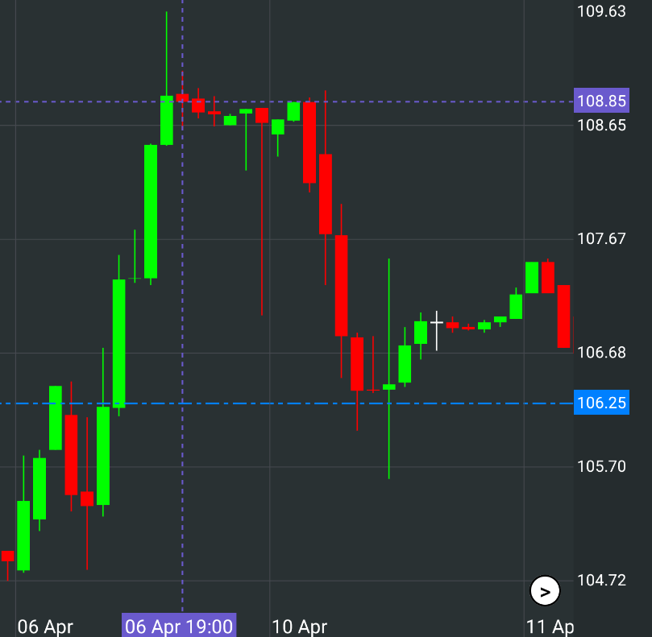
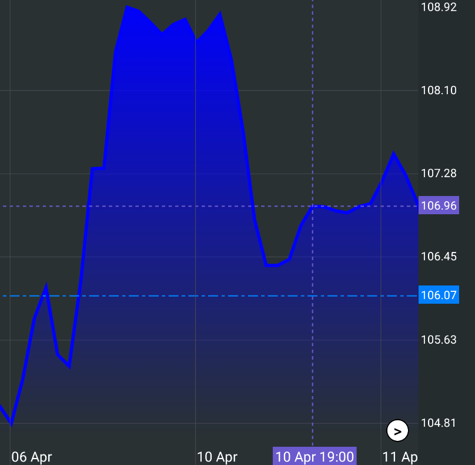

# Charting Library
## Candlestick Chart

> Candlestick charts are a Japanese way of reading price action. Candlestick charts display the absolute values of the open, high, low, and closing prices for a given time frame.
### Creating Data Feed:

to create a feed you need to pass MutableList of `CandleFeed`, where the time is a unix-time string:
```kotlin
data class CandleFeed(
    val open: Float,
    val close: Float,
    val high: Float,
    val low: Float,
    val time: String
)
```
### Using CandleStickChart in your project:

```kotlin
// required data:
val candleFeed = remember { mutableStateOf(mutableListOf<CandleFeed>()) }
val timeFormat = remember { mutableStateOf(listOf<String>()) }
val selectedTimeFormat = remember { mutableStateOf(listOf<String>()) }

// creating a chart:
CandlestickChart(
    candleFeed = candleFeed.value,
    timeFormat = timeFormat.value,
    selectedTimeFormat = selectedTimeFormat.value,
)
```
### Example of data preparation:
```kotlin
val candles = mutableListOf<CandleFeed>()

for (i in 0..100) {
    
    ...

    candles.add(
        CandleFeed(
            open.toFloat(),
            close.toFloat(),
            max.toFloat(),
            min.toFloat(),
            unixTime.toString()
        )
    )
}
candleFeed.value = candles
```
> Don't pass more candles to the list of CandleFeed than the ConstraintLayout can display (260000 pixels). 
> Maximum number of candles: 260000 / ((candleWidthInPx + gapWidthInPx) * candleFeed.size)

you should use a TimeData enum to create a template by which date and time data will be parsed.
```kotlin
// 17 Mar
timeFormat.value = listOf(TimeData.DAY.index, " ", TimeData.MONTH_SHORT.index)
// 17 Mar 18:00
selectedTimeFormat.value = listOf(
    TimeData.DAY.index, " ", TimeData.MONTH_SHORT.index, " ", TimeData.HOUR.index, ":", TimeData.MINUTE.index
)
```
### Optional data (customization):


- `priceTagsCount` the number of price tags, not counting the maximum and minimum price tags, located to the right on the chart.
- `minIndent` the minimum distance between the time tags, measured in the number of candles.
- `dateOffset` offset of the time tags, measured in the number of candles.
- `chartWidth` the width of the chart in Dp.
- `chartHeight` the height of the chart in Dp.
- `candleWidth` candle thickness in Dp.
- `gapWidth` the thickness of the gap between the candles in Dp.
- `topOffset` indentation at the top of the chart.
- `rightBarWidth` the thickness of the right panel in Dp.
- `rightBarTextSize` the font size of the prices on the right panel.
- `significantDigits` the number of digits after the decimal point in prices.
- `bottomBarHeight` height of the bottom panel of the chart.
- `dojiCandleThickness` the thickness of the doji-candle body in Dp.
- `priceLineThickness` the thickness of the last price line in Dp.
- `priceLineStyle` the effect of the last price line.
- `selectedLineThickness` the thickness of the selected price line in Dp.
- `selectedLineStyle` the effect of the selected price line.
- `endButtonSize` the size of the end-button in Dp.

if you need to update optional data after creating a chart or if you upload a new list of candles, you must inform about it as follows, in order to display the changes correctly:
```kotlin
val reDraw = remember{mutableStateOf(false)}

CandlestickChart(
    candleFeed = candleFeed.value,
    timeFormat = timeFormat.value,
    selectedTimeFormat = selectedTimeFormat.value,
    ...
    reDraw = reDraw.value
)

fun updateData() {
    ...
    // here we can change the list of candles and change the optional data
    ...

    reDraw.value = !reDraw.value
}
```
if you need to update the chart in real time by adding one new candle to the list or changing the last candle, you need to inform after each update as follows:
```kotlin
val liveUpdate = remember{mutableStateOf(false)}

CandlestickChart(
    candleFeed = candleFeed.value,
    timeFormat = timeFormat.value,
    selectedTimeFormat = selectedTimeFormat.value,
    ...
    liveUpdate = liveUpdate.value
)

fun updateСandleFeed {
    ...
    // here we can add a new candle to the list, or change the parameters of the last one
    ...

    liveUpdate.value = !liveUpdate.value
}
```
### Optional data (color customization):

- `backgroundColor` the main background color of the chart
- `rightBarColor` color of the right panel with prices
- `textColor` color of the text on the chart
- `separatorColor` color of the auxiliary lines on the chart. If you want them not to be displayed, make their transparency equal to zero
- `priceColor` accent color of the last price and the corresponding auxiliary line
- `selectedColor` accent color of the price of the highlighted candle and the corresponding auxiliary line
- `positiveCandleColor` color of the growth candle
- `negativeCandleColor` color of the drop candle
- `dojiCandleColor` color of the candle with the same opening and closing price
- `endButtonColor` color of to the end button

## Area Chart

> Traditional price change chart with a gradient
### Creating Data Feed:

to create a feed you need to pass MutableList of `AreaFeed`, where the time is a unix-time string:
```kotlin
data class AreaFeed(
    val price: Float,
    val time: String
)
```